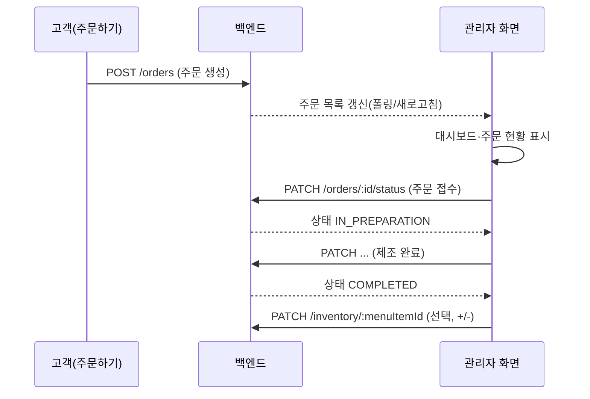

# 관리자 화면 PRD

> 상위 문서: [PRD.md](./PRD.md)  
> 화면 ID: `admin`  
> 앱 브랜드명: **COZY**  
> 연관 문서: [PRD-order-screen.md](./PRD-order-screen.md)

## 1. 개요

### 1.1 목적
매장 관리자가 **주문 현황을 실시간으로 확인**하고, 주문 상태를 단계별로 처리하며, **메뉴별 재고를 조회·수동 조정**할 수 있는 화면을 제공한다.

### 1.2 범위
- 본 문서는 **관리자** 화면의 프런트엔드 UI·동작 및 필요한 백엔드 연동을 정의한다.
- **주문하기** 화면 상세는 [PRD-order-screen.md](./PRD-order-screen.md)를 따른다.
- 사용자 인증·역할 분리(로그인)는 제외한다([PRD.md](./PRD.md) 기본 사항).
- 결제·배송·영수증 출력 등은 포함하지 않는다.

### 1.3 대상 사용자
- 매장에서 주문을 접수·제조·완료 처리하는 관리자(키오스크·태블릿·PC 웹)

### 1.4 성공 지표(학습 프로젝트 기준)
- 고객이 주문하기 화면에서 접수한 주문이 관리자 화면 **주문 현황**에 표시된다.
- 관리자가 상태 버튼을 눌러 주문을 **접수 → 제조 중 → 제조 완료**까지 진행할 수 있다.
- 대시보드 요약 수치가 주문 상태 변경에 맞게 갱신된다.
- 재고 카드에서 `+` / `-`로 수량을 조정할 수 있다.

---

## 2. 화면 구조(와이어프레임 기준)

화면은 위에서 아래로 **헤더 → 관리자 대시보드 요약 → 재고 현황 → 주문 현황** 네 영역으로 구성한다.

```
┌─────────────────────────────────────────────────────────┐
│  COZY                    [ 주문하기 ]  [ 관리자 ]        │  ← 헤더 (관리자 활성)
├─────────────────────────────────────────────────────────┤
│  관리자 대시보드                                         │
│  총 주문 N · 주문 접수 N · 제조 중 N · 제조 완료 N       │  ← 요약 지표
├─────────────────────────────────────────────────────────┤
│  재고 현황                                               │
│  [메뉴 카드 -/+] [메뉴 카드 -/+] [메뉴 카드 -/+] ...       │  ← 재고 카드 그리드
├─────────────────────────────────────────────────────────┤
│  주문 현황                                               │
│  · 시각 · 주문 내용 · 금액 · [ 상태 액션 버튼 ]          │  ← 주문 목록
└─────────────────────────────────────────────────────────┘
```

---

## 3. UI 구성 요소

### 3.1 헤더(공통 네비게이션)

[PRD-order-screen.md](./PRD-order-screen.md) §3.1과 동일한 구조를 사용한다.

| 요소 | 설명 | 요구사항 |
|------|------|----------|
| 로고/앱명 | `COZY` | 좌측 정렬, 클릭 시 주문하기 화면으로 이동 가능 |
| 탭 `주문하기` | 고객 주문 화면 | 비활성 스타일, 클릭 시 주문하기 화면으로 라우팅 |
| 탭 `관리자` | 현재 화면 | **활성** 상태: 테두리 등으로 현재 위치 표시 |

**동작**
- 두 탭 중 하나만 활성화한다.
- 관리자 화면 진입 시 주문·재고 데이터를 **최신 상태로 조회**(폴링 또는 구현 단계에서 선택한 갱신 방식).

---

### 3.2 관리자 대시보드(요약 지표)

| 요소 | 설명 |
|------|------|
| 섹션 제목 | `관리자 대시보드` |
| 지표 나열 | 한 줄(또는 좁은 화면에서 줄바꿈)에 4개 카운트 |

#### 3.2.1 지표 정의

| 라벨 | 의미 | 집계 규칙 |
|------|------|-----------|
| 총 주문 | 당일(또는 미완료 포함) 전체 주문 건수 | **취소·삭제 제외**한 모든 주문 레코드 수. 기본: **미완료(제조 완료 이전) + 제조 완료**를 합산한 “활성 주문” 또는 서버 정의에 따른 전체 건수 — 구현 시 **동일 기준**을 API와 맞출 것 |
| 주문 접수 | 접수 대기 | 상태 = `PENDING`(또는 `RECEIVED` 대기) |
| 제조 중 | 제조 진행 중 | 상태 = `IN_PREPARATION` |
| 제조 완료 | 제조 완료 | 상태 = `COMPLETED` |

와이어프레임 예: `총 주문 1 · 주문 접수 1 · 제조 중 0 · 제조 완료 0`

**동작**
- 주문 상태가 바뀔 때마다 4개 수치를 **재계산**하여 표시한다.
- 초기 로딩·갱신 중에는 로딩 표시 또는 이전 값 유지 중 하나를 일관되게 적용한다.

---

### 3.3 재고 현황

| 요소 | 설명 |
|------|------|
| 섹션 제목 | `재고 현황` |
| 레이아웃 | 메뉴(또는 재고 단위)별 **카드** 가로 배치; 좁은 화면에서는 스택 또는 가로 스크롤 |

#### 3.3.1 재고 카드 구성

| 영역 | 필드 | 표시 예 | 비고 |
|------|------|---------|------|
| 메뉴명 | `name` | `아메리카노 (ICE)` | 주문하기 메뉴와 동일 명칭 권장 |
| 수량 | `stockQuantity` | `10개` | 정수, `개` 접미사 |
| 감소 | `-` 버튼 | — | 1 감소, **0 미만 불가** |
| 증가 | `+` 버튼 | — | 1 증가 |

와이어프레임 예시 메뉴: 아메리카노(ICE), 아메리카노(HOT), 카페라떼 — 각 10개.

**동작**
- `+` / `-` 클릭 시 **즉시 UI 반영** 후 서버에 재고 수정 요청(또는 낙관적 업데이트 + 실패 시 롤백).
- 수량이 `0`일 때 `-`는 **비활성** 또는 클릭 무시.
- 상한(예: 999)은 구현 시 합리적 상한을 둘 수 있음 — 와이어프레임 미정의.

**비즈니스 규칙(재고)**
- 와이어프레임은 **수동 조정**을 전제한다. 주문 완료 시 재고 자동 차감 여부는 **오픈 이슈**(§11)로 두고, 1차 구현에서는 **수동만**으로도 수용 기준을 충족할 수 있다.
- (선택) 주문하기 화면에서 “품절” 표시를 연동할 경우, 재고 `0`인 메뉴는 담기 비활성 등 — 2차 연동.

---

### 3.4 주문 현황

| 요소 | 설명 |
|------|------|
| 섹션 제목 | `주문 현황` |
| 레이아웃 | 주문별 **한 줄(또는 카드)**; 최신 주문이 위에 오도록 **내림차순(주문 시각)** 권장 |

#### 3.4.1 주문 행 구성

| 영역 | 필드 | 표시 예 | 비고 |
|------|------|---------|------|
| 주문 시각 | `orderedAt` | `7월 31일 13:00` | 로컬 타임존, `M월 D일 HH:mm` 형식 |
| 주문 내용 | `itemsSummary` | `아메리카노(ICE) x 1` | 복수 품목: `메뉴 x 수량`을 `, `로 연결 |
| 금액 | `totalAmount` | `4,000원` | 천 단위 콤마, `원` 접미사 |
| 액션 | 상태별 버튼 | `주문 접수` 등 | 현재 상태의 **다음 단계**로 진행 |

**표기 규칙(주문 내용)**
- 옵션이 있으면 주문하기 화면과 동일하게 괄호 표기 가능: `아메리카노(ICE) (샷 추가) x 1`
- 한 주문에 여러 라인이면 요약 문자열에 모두 포함.

#### 3.4.2 주문 상태 및 액션 버튼

| 상태 코드 | UI 라벨(요약·필터) | 행에 표시되는 버튼 | 클릭 후 다음 상태 |
|-----------|-------------------|-------------------|-------------------|
| `PENDING` | 주문 접수(대기) | `주문 접수` | `IN_PREPARATION` |
| `IN_PREPARATION` | 제조 중 | `제조 시작` 또는 `제조 완료` — 와이어프레임은 1단계 버튼만 표기; **권장**: `제조 완료` | `COMPLETED` |
| `COMPLETED` | 제조 완료 | 버튼 없음 또는 `완료` 비활성 표시 | — |

와이어프레임은 **접수 전** 주문에 `주문 접수` 버튼만 예시로 보여 준다. 제조 중·완료 단계 버튼 문구는 구현 시 위 표를 따르되, **한 번에 한 단계만** 전진한다.

**동작**
- 버튼 클릭 → API로 상태 변경 → 성공 시 목록·대시보드 요약 갱신.
- 요청 중 해당 행 버튼 비활성화(중복 클릭 방지).
- 실패 시 에러 메시지, 상태 유지.

**빈 상태**
- 주문이 없으면 `주문이 없습니다` 등 안내 문구.

---

## 4. 사용자 흐름



1. 고객이 주문하기에서 `주문하기`를 완료하면 새 주문이 생성된다.
2. 관리자 화면 **주문 현황**에 해당 주문이 나타나고, 요약의 **주문 접수**(대기) 카운트가 증가한다.
3. 관리자가 `주문 접수`를 누르면 주문이 **제조 중**으로 바뀌고 요약 수치가 갱신된다.
4. 이후 `제조 완료`(또는 동등 액션)로 **제조 완료** 상태가 된다.
5. 재고는 필요 시 **재고 현황**에서 `+` / `-`로 수동 조정한다.

---

## 5. 데이터·상태

### 5.1 주문(관리자 목록용)

```ts
AdminOrder {
  id: string
  orderedAt: string       // ISO 8601
  status: 'PENDING' | 'IN_PREPARATION' | 'COMPLETED'
  items: OrderLine[]      // 주문하기와 동일 개념
  totalAmount: number
  itemsSummary?: string   // 서버 생성 또는 클라이언트 파생
}

OrderLine {
  menuItemId: string
  menuName: string
  optionLabels?: string[]
  quantity: number
  unitPrice: number
  lineTotal: number
}
```

### 5.2 재고

```ts
InventoryItem {
  menuItemId: string
  name: string
  stockQuantity: number   // 0 이상 정수
}
```

초기 시드 예(와이어프레임): 아메리카노(ICE), 아메리카노(HOT), 카페라떼 — 각 10개.

### 5.3 대시보드 요약

```ts
DashboardSummary {
  totalOrders: number
  pendingCount: number      // 주문 접수 대기
  inPreparationCount: number
  completedCount: number
}
```

- API가 요약 객체를 내려주거나, 주문 목록을 클라이언트에서 집계할 수 있다. **단일 진실 공급원**은 서버 권장.

### 5.4 화면 로컬 상태

| 상태 | 설명 |
|------|------|
| `summary` | 대시보드 4종 카운트 |
| `inventory` | 재고 카드 목록 |
| `orders` | 주문 현황 목록(로딩/에러 포함) |
| `updatingOrderId` | 상태 변경 요청 중인 주문 id |
| `updatingStockId` | 재고 수정 요청 중인 메뉴 id |

---

## 6. 비즈니스 규칙

1. **주문 상태 전이**: `PENDING` → `IN_PREPARATION` → `COMPLETED`만 허용(역행·건너뛰기 없음).
2. **금액 표시**: 원화 정수, 천 단위 콤마([PRD-order-screen.md](./PRD-order-screen.md)와 동일).
3. **재고 하한**: `stockQuantity`는 0 미만이 될 수 없다.
4. **실시간성**: 새 주문 반영을 위해 주기적 **폴링**(예: 5~10초) 또는 페이지 포커스 시 재조회 — WebSocket은 학습 범위 밖이면 생략 가능.
5. **인증**: 없음; 관리자 URL·탭만으로 진입([PRD.md](./PRD.md)).

---

## 7. API 연동(참고)

엔드포인트명은 구현 시 확정. 주문 생성은 [PRD-order-screen.md](./PRD-order-screen.md) §6과 공유한다.

| 동작 | 메서드 | 설명 |
|------|--------|------|
| 주문 목록(관리자) | `GET /orders` | query: `status` 선택, 기본 전체 또는 미완료만 |
| 주문 상태 변경 | `PATCH /orders/:id/status` | body: `{ "status": "IN_PREPARATION" }` |
| 대시보드 요약 | `GET /orders/summary` 또는 목록 집계 | 4종 카운트 |
| 재고 목록 | `GET /inventory` | 메뉴별 수량 |
| 재고 수정 | `PATCH /inventory/:menuItemId` | body: `{ "stockQuantity": 9 }` 또는 `{ "delta": -1 }` |

주문 상태 변경 요청 예:

```json
{
  "status": "IN_PREPARATION"
}
```

재고 수정 요청 예(delta 방식):

```json
{
  "delta": 1
}
```

---

## 8. 예외·엣지 케이스

| 상황 | 기대 동작 |
|------|-----------|
| 주문 목록 로딩 중 | 스켈레톤 또는 로딩 문구 |
| 주문 0건 | 빈 상태 메시지, 요약은 0 |
| 목록 로드 실패 | 재시도 안내 |
| 상태 변경 중 중복 클릭 | 해당 행 버튼 비활성 |
| 상태 변경 실패 | 에러 메시지, 이전 상태 유지 |
| 재고 0에서 `-` | 무시 또는 버튼 비활성 |
| 재고 수정 실패 | UI 롤백 또는 서버 값으로 재동기화 |
| 동시에 두 관리자 탭(학습 범위) | 마지막 쓰기 우선; 충돌 처리는 단순화 가능 |

---

## 9. 접근성·반응형(권장)

- `+` / `-`, 상태 버튼에 키보드 포커스 및 `aria-label`(예: `아메리카노 ICE 재고 증가`)
- 활성 탭 `aria-current="page"`
- 좁은 화면: 재고 카드·주문 행 세로 스택, 요약 지표 줄바꿈

---

## 10. 수용 기준(Acceptance Criteria)

- [ ] 헤더에 `COZY`, `주문하기`(비활성), `관리자`(활성)가 보인다.
- [ ] `관리자 대시보드`에 총 주문·주문 접수·제조 중·제조 완료 4개 수치가 표시된다.
- [ ] 주문 상태 변경 시 4개 수치가 일관되게 갱신된다.
- [ ] `재고 현황`에 메뉴별 카드(이름, `N개`, `-`, `+`)가 있다.
- [ ] `-`로 0 미만이 되지 않으며, `+`로 수량이 증가한다.
- [ ] `주문 현황`에 시각·주문 내용·금액·상태 액션 버튼이 표시된다.
- [ ] `주문 접수` 클릭 시 해당 주문이 제조 중(다음 단계)으로 바뀐다.
- [ ] 제조 완료까지 진행 가능하고, 완료 후 적절한 UI(버튼 비활성 등)가 된다.
- [ ] 주문하기에서 생성한 주문이 관리자 화면에 나타난다(폴링 또는 새로고침 포함).
- [ ] `주문하기` 탭 클릭 시 주문하기 화면으로 이동한다.

---

## 11. 미포함(Out of Scope)

- 관리자 로그인·권한·감사 로그
- 주문 취소·환불·수정(고객 주문 내용 변경)
- 주문별 상세 모달·영수증 인쇄
- 재고 이력·알림·자동 발주
- WebSocket 기반 실시간 푸시(1차)
- 다국어

---

## 12. 오픈 이슈

| # | 항목 | 비고 |
|---|------|------|
| 1 | `총 주문` 집계 범위 | 당일만 vs 미삭제 전체 vs 활성 주문만 — API·UI 일치 필요 |
| 2 | 제조 중 단계 버튼 문구 | 와이어프레임은 `주문 접수`만 명시; `제조 완료` 등 확정 |
| 3 | 주문 완료 시 재고 자동 차감 | 수동만 vs 주문 상태 `COMPLETED` 시 차감 |
| 4 | 폴링 주기 vs 수동 새로고침 | UX·서버 부하 trade-off |
| 5 | 완료된 주문 목록 노출 기간 | 목록에서 숨김 vs 계속 표시 |
| 6 | 카페라떼 등 미정의 메뉴 재고 | 주문 PRD와 동일 시드 확정 |

---

## 13. 와이어프레임 참조

관리자 화면 와이어프레임(대시보드 4지표, 재고 카드 3종·각 10개, 주문 1건·`7월 31일 13:00`·`아메리카노(ICE) x 1`·`4,000원`·`주문 접수` 버튼)을 UI 레이아웃·카피의 기준으로 삼는다.
